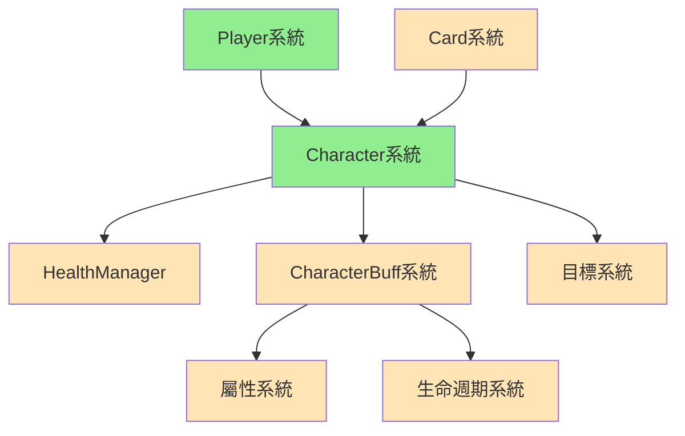

# Character 角色系統筆記

## 系統概述
Character系統是MortalGame的戰鬥核心系統，負責管理具有血量的戰鬥單位。每個Character都是一個獨立的戰鬥實體，擁有血量、護甲、Buff狀態等屬性。玩家的勝負條件直接依賴於Character的存活狀態：**當玩家的所有Character血量歸零時，該玩家戰敗**。

**核心設計理念**：
- **血量驅動**：Character的存活直接決定戰鬥勝負
- **狀態豐富**：支援複雜的Buff狀態管理
- **獨立性**：每個Character都是獨立的戰鬥單位
- **可擴展**：為未來多角色戰鬥預留架構

**檔案位置**: 
- [CharacterEntity.cs](../../Assets/Scripts/GameModel/Entity/CharacterEntity.cs)
- [CharacterBuffData.cs](../../Assets/Scripts/GameData/CharacterBuff/CharacterBuffData.cs)
- [CharacterBuffEntity.cs](../../Assets/Scripts/GameModel/Entity/CharacterBuff/CharacterBuffEntity.cs)

## 系統架構

### 🏗️ 雙層架構設計
```
Character系統
├── CharacterEntity        ← 角色實體層（血量、護甲、管理器）
│   ├── HealthManager      ← 血量/護甲管理
│   └── BuffManager        ← Buff狀態管理
└── CharacterBuff系統      ← Buff狀態層（類似CardBuff）
    ├── CharacterBuffData  ← Buff資料模板
    └── CharacterBuffEntity← Buff實體狀態
```

### 🔗 與其他系統的關係


**系統依賴**：
- **被Player依賴**：Player透過Characters集合管理多個Character
- **被Card依賴**：卡片效果會影響Character的血量和狀態
- **依賴Health系統**：管理血量和護甲數值
- **依賴Buff系統**：管理角色身上的各種狀態效果

## Character實體系統

### ICharacterEntity 核心接口
```csharp
public interface ICharacterEntity
{
    // 身份識別
    Guid Identity { get; }          // 唯一標識
    string NameKey { get; }         // 名稱鍵值（本地化）
    
    // 核心管理器
    IHealthManager HealthManager { get; }           // 血量管理
    ICharacterBuffManager BuffManager { get; }     // Buff管理
    
    // 快速屬性訪問
    int CurrentHealth { get; }      // 當前血量
    int MaxHealth { get; }          // 最大血量
    int CurrentArmor { get; }       // 當前護甲
    bool IsDead { get; }           // 死亡狀態
}
```

**接口設計特點**：
- **管理器委託**：透過專門的管理器處理複雜邏輯
- **快速訪問**：提供常用屬性的直接訪問
- **狀態查詢**：支援死亡等關鍵狀態判斷

### CharacterEntity 實現類別
```csharp
public class CharacterEntity : ICharacterEntity
{
    // 核心欄位
    private readonly Guid _identity;
    private readonly string _nameKey;
    private readonly IHealthManager _healthManager;
    private readonly ICharacterBuffManager _buffManager;
    
    // 死亡判定
    public bool IsDead => CurrentHealth <= 0;
    
    // 空值物件
    public static ICharacterEntity DummyCharacter = new DummyCharacter();
}
```

**實現特色**：
- **自動ID生成**：建構時自動產生唯一標識
- **組合模式**：透過管理器組合實現複雜功能
- **安全判定**：簡潔的死亡狀態判定邏輯
- **空值物件**：提供安全的預設值

## CharacterBuff系統

### 設計理念對比
| 特性 | CardBuff | CharacterBuff |
|------|----------|---------------|
| **作用目標** | 卡片實體 | 角色實體 |
| **影響範圍** | 卡片屬性、效果 | 角色血量、護甲、行為 |
| **生命週期** | 跟隨卡片 | 跟隨角色 |
| **觸發時機** | 卡片使用時 | 回合開始/結束/特定事件 |
| **數值修正** | 攻擊力、消耗 | 血量上限、護甲值、傷害減免 |

### CharacterBuffData 資料結構
```csharp
public class CharacterBuffData
{
    [TitleGroup("BasicData")]
    public string ID;                    // Buff唯一標識
    public int MaxLevel;                 // 最大層數
    
    // 反應會話系統
    public Dictionary<string, IReactionSessionData> Sessions;
    
    // 時機效果系統
    public Dictionary<GameTiming, ConditionalCharacterBuffEffect[]> BuffEffects;
    
    // 屬性修正系統
    public List<ICharacterBuffPropertyData> PropertyDatas;
    
    // 生命週期系統
    public ICharacterBuffLifeTimeData LifeTimeData;
}
```

**資料特色**：
- **分層配置**：基礎資訊、效果、屬性、生命週期分離
- **時機驅動**：基於GameTiming的效果觸發系統
- **反應機制**：支援複雜的互動邏輯
- **編輯友好**：使用Odin Inspector優化編輯體驗

### CharacterBuffEntity 實體狀態
```csharp
public class CharacterBuffEntity : ICharacterBuffEntity
{
    // 核心屬性
    public string Id { get; }                    // Buff標識
    public Guid Identity { get; }                // 實體標識
    public int Level { get; }                    // 當前層數
    public Option<IPlayerEntity> Caster { get; } // 施術者
    
    // 管理系統
    public IReadOnlyCollection<ICharacterBuffPropertyEntity> Properties { get; }
    public ICharacterBuffLifeTimeEntity LifeTime { get; }
    public IReadOnlyDictionary<string, IReactionSessionEntity> ReactionSessions { get; }
    
    // 狀態操作
    bool IsExpired();                // 是否過期
    void AddLevel(int level);        // 增加層數
}
```

**實體特色**：
- **層數管理**：支援可疊加的Buff效果
- **施術者追蹤**：記錄Buff的來源玩家
- **過期管理**：自動處理Buff的生命週期
- **屬性計算**：動態計算Buff提供的屬性加成

## 戰鬥勝負系統

### 死亡判定邏輯
```csharp
// Character層級：單個角色死亡
public bool IsDead => CurrentHealth <= 0;

// Player層級：所有角色死亡 (來自PlayerEntity)
public bool IsDead => Characters.All(character => character.IsDead);
```

**勝負機制**：
1. **個體死亡**：Character血量≤0時標記為死亡
2. **玩家敗北**：Player的所有Character都死亡時戰敗
3. **戰鬥結束**：任一Player戰敗時結束戰鬥

### 多角色戰術意義
```csharp
// 當前實現：每個Player只有一個Character
public ICharacterEntity MainCharacter => Characters.First();

// 未來擴展：多角色戰術
// - 主角色：核心戰鬥單位
// - 助理角色：提供支援效果
// - 保護策略：重要角色的生存管理
```

## 管理器系統整合

### IHealthManager 血量管理
```csharp
public interface IHealthManager
{
    int Hp { get; }          // 當前血量
    int MaxHp { get; }       // 最大血量
    int Dp { get; }          // 當前護甲(Defense Point)
    
    // 傷害處理邏輯
    // 護甲減傷機制
    // 血量上限調整
}
```

### ICharacterBuffManager Buff管理
```csharp
public interface ICharacterBuffManager
{
    IReadOnlyCollection<ICharacterBuffEntity> Buffs { get; }
    
    // Buff添加/移除
    // 過期檢查
    // 屬性計算整合
    // 觸發時機處理
}
```

## 查詢和擴展系統

### 全域查詢功能
```csharp
public static class CharacterEntityExtensions
{
    // 根據ID查找Character
    public static Option<ICharacterEntity> GetCharacter(this IGameplayModel model, Guid identity)
    
    // 查找Character的擁有者
    public static Option<IPlayerEntity> Owner(this ICharacterEntity character, IGameplayModel model)
    
    // 確定Character的陣營
    public static Faction Faction(this ICharacterEntity character, IGameplayModel model)
}
```

**查詢特色**：
- **全域搜索**：跨Player查找特定Character
- **所有權追蹤**：快速確定Character的歸屬
- **陣營識別**：支援友軍/敵軍判定
- **安全返回**：使用Option避免null引用

### CharacterBuff查詢功能
```csharp
public static class CharacterBuffEntityExtensions
{
    // 轉換為顯示資訊
    public static CharacterBuffInfo ToInfo(this ICharacterBuffEntity characterBuff, IGameplayModel gameWatcher)
    
    // 查找Buff的擁有者
    public static Option<IPlayerEntity> Owner(this ICharacterBuffEntity characterBuff, IGameplayModel gameplayWatcher)
}
```

## 空值物件模式

### DummyCharacter 空角色
```csharp
public class DummyCharacter : CharacterEntity
{
    public DummyCharacter() : base(string.Empty, 0, 0) { }
}

public static ICharacterEntity DummyCharacter = new DummyCharacter();
```

### DummyCharacterBuff 空Buff
```csharp
public class DummyCharacterBuff : CharacterBuffEntity
{
    public DummyCharacterBuff() : base(
        string.Empty,           // ID
        Guid.Empty,            // Identity
        1,                     // Level
        Option.None<IPlayerEntity>(),  // Caster
        Enumerable.Empty<ICharacterBuffPropertyEntity>(), // Properties
        new AlwaysLifeTimeCharacterBuffEntity(),          // LifeTime
        new Dictionary<string, IReactionSessionEntity>()  // Sessions
    ) { }
}
```

**空值物件優勢**：
- **避免null檢查**：提供安全的預設行為
- **統一接口**：實現相同的ICharacterEntity接口
- **無副作用**：所有操作都是安全的空操作
- **調試友好**：便於識別和追蹤問題

## 工廠模式應用

### CharacterParameter 建構參數
```csharp
public record CharacterParameter
{
    public string NameKey;      // 角色名稱
    public int CurrentHealth;   // 當前血量
    public int MaxHealth;       // 最大血量
}
```

### Create工廠方法
```csharp
public static CharacterEntity Create(CharacterParameter characterParameter)
{
    return new CharacterEntity(
        characterParameter.NameKey, 
        characterParameter.CurrentHealth, 
        characterParameter.MaxHealth
    );
}
```

**工廠優勢**：
- **參數封裝**：使用Record結構確保資料完整性
- **建構簡化**：統一的創建介面
- **擴展友好**：未來可加入更多建構邏輯
- **類型安全**：編譯時確保參數正確

## 設計模式總結

### 🎭 組合模式 (Composite Pattern)
```csharp
CharacterEntity = Identity + Name + HealthManager + BuffManager
```

### 🏗️ 工廠模式 (Factory Pattern)
```csharp
CharacterEntity.Create(CharacterParameter) → CharacterEntity
```

### 🚫 空值物件模式 (Null Object Pattern)
```csharp
DummyCharacter, DummyCharacterBuff → 安全的預設值
```

### 📋 策略模式 (Strategy Pattern)
```csharp
IHealthManager, ICharacterBuffManager → 不同的管理策略
```

### 🔍 查詢模式 (Query Pattern)
```csharp
擴展方法提供靈活的查詢功能
```

## 依賴關係

### 依賴的組件
- **🔗 IHealthManager**: 血量管理 *需要HealthManager_Class.md*
- **🔗 ICharacterBuffManager**: Buff管理 *需要CharacterBuffManager_Class.md*
- **🔗 IPlayerEntity**: 玩家實體 *參考PlayerEntity_Class.md*
- **🔗 GameTiming**: 遊戲時機 *需要GameTiming_Enum.md*
- **🔗 Faction**: 陣營枚舉 *需要Faction_Enum.md*
- **🔗 Optional**: 安全空值處理 *需要Optional_Library.md*
- **🔗 IGameplayModel**: 遊戲狀態 *需要GameplayModel_Class.md*

### 被依賴的組件
- **🔗 PlayerEntity**: 管理Characters集合 *參考PlayerEntity_Class.md*
- **🔗 CardEffect**: 卡片效果影響Character *需要CardEffect_System.md*
- **🔗 Target系統**: Character作為目標 *需要Target_System.md*
- **🔗 UI系統**: 顯示Character狀態 *需要UI_System.md*

## 使用範例

### Character創建
```csharp
var characterParam = new CharacterParameter
{
    NameKey = "hero.protagonist",
    CurrentHealth = 100,
    MaxHealth = 100
};

var character = CharacterEntity.Create(characterParam);
```

### 血量操作
```csharp
// 查看狀態
Debug.Log($"血量: {character.CurrentHealth}/{character.MaxHealth}");
Debug.Log($"護甲: {character.CurrentArmor}");
Debug.Log($"是否死亡: {character.IsDead}");

// 透過HealthManager進行傷害處理
character.HealthManager.TakeDamage(30);
```

### Buff管理
```csharp
// 添加Buff
var poisonBuff = CreatePoisonBuff();
character.BuffManager.AddBuff(poisonBuff);

// 查看所有Buff
foreach (var buff in character.BuffManager.Buffs)
{
    Debug.Log($"Buff: {buff.Id}, 層數: {buff.Level}");
}

// 更新Buff狀態
character.BuffManager.UpdateBuffs(triggerContext);
```

### 查詢操作
```csharp
// 根據ID查找Character
var targetCharacter = gameplayModel.GetCharacter(characterId);

// 查找Character的擁有者
var owner = character.Owner(gameplayModel);

// 確定陣營
var faction = character.Faction(gameplayModel);
```

## 戰鬥流程整合

### 傷害計算流程
1. **來源確定**: 確定傷害來源（卡片、Buff等）
2. **目標選擇**: 選擇受傷害的Character
3. **護甲計算**: 根據護甲值減少傷害
4. **血量扣除**: 應用最終傷害到血量
5. **狀態更新**: 更新死亡狀態和相關Buff

### Buff觸發流程
1. **時機檢查**: 確認當前是否為Buff觸發時機
2. **條件判定**: 檢查Buff的觸發條件
3. **效果執行**: 執行Buff的效果邏輯
4. **屬性更新**: 更新Character的屬性值
5. **生命週期**: 檢查Buff是否過期並清理

---

## 相關檔案
| 檔案 | 關係 | 描述 |
|------|------|------|
| [CharacterEntity.cs](../../Assets/Scripts/GameModel/Entity/CharacterEntity.cs) | 核心 | 角色實體完整實現 |
| [CharacterBuffData.cs](../../Assets/Scripts/GameData/CharacterBuff/CharacterBuffData.cs) | 核心 | 角色Buff資料定義 |
| [CharacterBuffEntity.cs](../../Assets/Scripts/GameModel/Entity/CharacterBuff/CharacterBuffEntity.cs) | 核心 | 角色Buff實體實現 |
| [PlayerEntity.cs](../../Assets/Scripts/GameModel/Entity/PlayerEntity.cs) | 依賴 | 管理Character集合 |

---

**最後更新**: 2024-12-20  
**版本**: v1.0  
**狀態**: ✅ 已完成