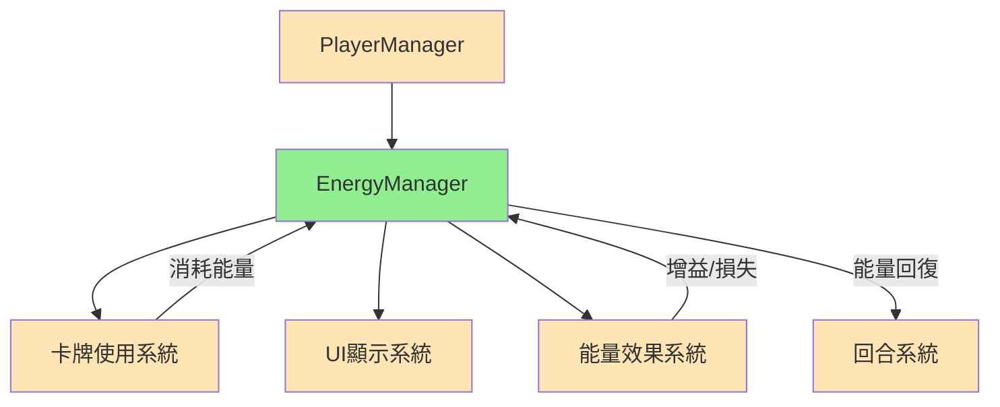

# EnergyManager 能量管理系統筆記

## 系統概述
EnergyManager是MortalGame中管理玩家能量(費用)的核心系統，負責處理所有與卡牌使用成本相關的邏輯。能量系統是卡牌遊戲的基礎資源機制，限制玩家每回合可以執行的操作，並透過能量回復、消耗、增益、損失等多種操作類型，提供豐富的策略層次。

**核心設計理念**：
- **資源限制**：透過能量上限控制玩家行動能力
- **操作分類**：不同類型的能量變化有不同的語義和效果
- **溢出處理**：妥善處理超出上限的能量操作
- **結果追蹤**：詳細記錄每次能量變化的結果
- **資訊透明**：提供完整的能量狀態資訊

**檔案位置**: [EnergyManager.cs](../../Assets/Scripts/GameModel/Entity/EnergyManager.cs)

## 系統架構

### 🏗️ 核心設計模式
```
EnergyManager系統
├── IEnergyManager接口    ← 能量管理契約
├── EnergyManager實現     ← 具體能量邏輯
├── 結果記錄系統          ← GainEnergyResult/LoseEnergyResult
└── 資訊系統             ← EnergyInfo資料傳輸
```

### 🔗 與其他系統的關係


**系統整合**：
- **被Player依賴**：每個Player都有一個EnergyManager實例
- **被Card依賴**：卡牌使用時消耗能量
- **被Effect依賴**：某些效果會影響能量
- **被UI依賴**：UI需要顯示當前能量狀態

## IEnergyManager 核心接口

### 接口定義
```csharp
public interface IEnergyManager
{
    // 狀態查詢
    int Energy { get; }                 // 當前能量
    int MaxEnergy { get; }              // 最大能量
    
    // 能量操作方法
    GainEnergyResult RecoverEnergy(int amount);   // 回復能量（回合開始）
    LoseEnergyResult ConsumeEnergy(int amount);   // 消耗能量（使用卡牌）
    GainEnergyResult GainEnergy(int amount);      // 增益能量（效果獲得）
    LoseEnergyResult LoseEnergy(int amount);      // 損失能量（效果失去）
    
    // 資訊輸出
    EnergyInfo ToInfo();                // 轉換為資訊物件
}
```

### 接口設計理念

#### 📊 狀態管理
```csharp
int Energy { get; }      // 當前可用能量
int MaxEnergy { get; }   // 能量上限
```

**狀態特色**：
- **即時查詢**：隨時可以查詢當前能量狀態
- **上限管理**：MaxEnergy控制能量獲得的上限
- **唯讀屬性**：外部無法直接修改，必須透過方法操作

#### ⚡ 能量操作分類

**四種操作類型的語義差異**：

| 操作類型 | 使用場景 | 特殊處理 | 結果類型 |
|---------|----------|----------|----------|
| **RecoverEnergy** | 回合開始回復 | 不能超過上限 | RoundStartRecover |
| **ConsumeEnergy** | 使用卡牌消耗 | 不能消耗超過現有 | PlayCardConsume |
| **GainEnergy** | 效果增益 | 不能超過上限 | GainEffect |
| **LoseEnergy** | 效果損失 | 不能損失超過現有 | LoseEffect |

#### 🎯 操作語義設計
```csharp
// 回合機制：每回合開始時回復能量
GainEnergyResult RecoverEnergy(int amount);

// 卡牌機制：使用卡牌時消耗能量
LoseEnergyResult ConsumeEnergy(int amount);

// 效果機制：獲得額外能量
GainEnergyResult GainEnergy(int amount);

// 效果機制：失去能量
LoseEnergyResult LoseEnergy(int amount);
```

**設計優勢**：
- **語義清晰**：不同方法名稱清楚表達操作意圖
- **追蹤便利**：結果類型包含操作類型，便於日誌和統計
- **擴展彈性**：未來可以為不同操作類型添加特殊邏輯
- **除錯友好**：可以追蹤能量變化的具體來源

## EnergyManager 實現類別

### 核心實現
```csharp
public class EnergyManager : IEnergyManager
{
    // 核心狀態
    private int _energy;        // 當前能量
    private int _maxEnergy;     // 最大能量
    
    // 屬性委託
    public int Energy => _energy;
    public int MaxEnergy => _maxEnergy;
    
    // 建構函數
    public EnergyManager(int energy, int maxEnergy)
    {
        _energy = energy;
        _maxEnergy = maxEnergy;
    }
}
```

### 核心操作實現

#### 📈 能量回復機制
```csharp
public GainEnergyResult RecoverEnergy(int amount)
{
    var deltaEp = _AcceptEnergyGain(amount, out var energyOver);

    return new GainEnergyResult(
        Type: EnergyGainType.RoundStartRecover,
        EnergyPoint: amount,
        DeltaEp: deltaEp,
        OverEp: energyOver
    );
}
```

**回復特色**：
- **回合機制**：專門用於回合開始的能量回復
- **上限限制**：不會超過MaxEnergy
- **溢出記錄**：記錄超出部分的能量
- **結果詳細**：包含請求量、實際變化、溢出量

#### 💰 能量消耗機制
```csharp
public LoseEnergyResult ConsumeEnergy(int amount)
{
    var deltaEp = _AcceptEnergyLoss(amount, out var energyOver);

    return new LoseEnergyResult(
        Type: EnergyLoseType.PlayCardConsume,
        EnergyPoint: amount,
        DeltaEp: deltaEp,
        OverEp: energyOver
    );
}
```

**消耗特色**：
- **卡牌機制**：專門用於卡牌使用的能量消耗
- **下限保護**：不會低於0
- **不足處理**：記錄不足的能量部分
- **操作安全**：即使能量不足也不會拋出異常

#### 🎁 能量增益機制
```csharp
public GainEnergyResult GainEnergy(int amount)
{
    var deltaEp = _AcceptEnergyGain(amount, out var energyOver);

    return new GainEnergyResult(
        Type: EnergyGainType.GainEffect,
        EnergyPoint: amount,
        DeltaEp: deltaEp,
        OverEp: energyOver
    );
}
```

**增益特色**：
- **效果機制**：用於卡牌或Buff提供的能量增益
- **上限遵守**：同樣受MaxEnergy限制
- **類型區別**：與RecoverEnergy在類型上有區別
- **統計分離**：可以分別統計回復和增益的能量

#### 💸 能量損失機制
```csharp
public LoseEnergyResult LoseEnergy(int amount)
{
    var deltaEp = _AcceptEnergyLoss(amount, out var energyOver);

    return new LoseEnergyResult(
        Type: EnergyLoseType.LoseEffect,
        EnergyPoint: amount,
        DeltaEp: deltaEp,
        OverEp: energyOver
    );
}
```

**損失特色**：
- **效果機制**：用於負面效果造成的能量損失
- **下限保護**：同樣不會低於0
- **類型區別**：與ConsumeEnergy在語義上不同
- **策略意義**：損失通常是懲罰性的，消耗是主動的

## 內部實現機制

### 能量增益處理
```csharp
private int _AcceptEnergyGain(int amount, out int energyOver)
{
    var originEnergy = _energy;
    _energy = Mathf.Clamp(_energy + amount, originEnergy, _maxEnergy);
    var deltaEnergy = _energy - originEnergy;
    energyOver = Mathf.Max(amount - deltaEnergy, 0);

    return deltaEnergy;
}
```

**增益處理特色**：
- **上限夾取**：使用Clamp確保不超過MaxEnergy
- **實際變化**：deltaEnergy記錄實際增加的能量
- **溢出計算**：energyOver記錄無法獲得的額外能量
- **數學準確**：確保 amount = deltaEnergy + energyOver

### 能量損失處理
```csharp
private int _AcceptEnergyLoss(int amount, out int energyOver)
{
    var originEnergy = _energy;
    _energy = Mathf.Clamp(_energy - amount, 0, originEnergy);
    var deltaEnergy = originEnergy - _energy;
    energyOver = Mathf.Max(amount - deltaEnergy, 0);

    return deltaEnergy;
}
```

**損失處理特色**：
- **下限保護**：使用Clamp確保不低於0
- **實際變化**：deltaEnergy記錄實際減少的能量
- **不足記錄**：energyOver記錄無法扣除的能量
- **一致性**：與增益處理保持相同的邏輯結構

### 數學安全性
```csharp
// 增益情況：
// _energy + amount <= _maxEnergy 時：deltaEnergy = amount, energyOver = 0
// _energy + amount >  _maxEnergy 時：deltaEnergy < amount, energyOver > 0

// 損失情況：
// _energy - amount >= 0 時：deltaEnergy = amount, energyOver = 0  
// _energy - amount <  0 時：deltaEnergy < amount, energyOver > 0
```

## 結果記錄系統

### GainEnergyResult 增益結果
```csharp
public record GainEnergyResult(
    EnergyGainType Type,        // 增益類型
    int EnergyPoint,            // 請求的能量點數
    int DeltaEp,                // 實際增加的能量
    int OverEp                  // 溢出的能量
);
```

### LoseEnergyResult 損失結果
```csharp
public record LoseEnergyResult(
    EnergyLoseType Type,        // 損失類型
    int EnergyPoint,            // 請求的能量點數
    int DeltaEp,                // 實際減少的能量
    int OverEp                  // 不足的能量
);
```

### 結果類型枚舉
```csharp
// 推測的枚舉定義
public enum EnergyGainType
{
    RoundStartRecover,          // 回合開始回復
    GainEffect                  // 增益效果
}

public enum EnergyLoseType
{
    PlayCardConsume,            // 卡牌消耗
    LoseEffect                  // 損失效果
}
```

**結果記錄優勢**：
- **完整資訊**：包含請求、實際、溢出三個關鍵數值
- **類型追蹤**：可以統計不同來源的能量變化
- **UI友好**：UI可以根據結果顯示適當的反饋
- **日誌支援**：便於生成詳細的遊戲日誌

## EnergyInfo 資訊系統

### 資訊結構
```csharp
public record EnergyInfo(int CurrentEnergy, int MaxEnergy);

public EnergyInfo ToInfo() => new EnergyInfo(_energy, _maxEnergy);
```

**資訊系統特色**：
- **不可變**：Record確保資訊的不可變性
- **輕量級**：只包含UI需要的核心資訊
- **安全性**：外部無法透過資訊物件修改狀態
- **序列化友好**：Record天然支援序列化

### 使用場景
```csharp
// UI顯示
var energyInfo = player.EnergyManager.ToInfo();
energyUI.UpdateDisplay(energyInfo.CurrentEnergy, energyInfo.MaxEnergy);

// 狀態保存
var gameState = new GameStateData
{
    PlayerEnergy = player.EnergyManager.ToInfo(),
    // 其他狀態...
};

// 網路傳輸
var energyUpdate = new EnergyUpdateMessage
{
    PlayerId = player.Id,
    EnergyInfo = player.EnergyManager.ToInfo()
};
```

## 使用範例

### Player系統整合
```csharp
public class PlayerEntity : IPlayerEntity
{
    private readonly IEnergyManager _energyManager;
    
    // 屬性委託
    public int CurrentEnergy => _energyManager.Energy;
    public int MaxEnergy => _energyManager.MaxEnergy;
    public IEnergyManager EnergyManager => _energyManager;
    
    // 建構函數
    public PlayerEntity(int currentEnergy, int maxEnergy)
    {
        _energyManager = new EnergyManager(currentEnergy, maxEnergy);
    }
}
```

### 回合開始能量回復
```csharp
public void StartTurn(IPlayerEntity currentPlayer)
{
    // 根據玩家類型回復能量
    int recoverAmount = currentPlayer is EnemyEntity enemy 
        ? enemy.EnergyRecoverPoint 
        : 1; // 友軍預設回復1點
    
    var result = currentPlayer.EnergyManager.RecoverEnergy(recoverAmount);
    
    // 記錄回復結果
    Debug.Log($"回合開始：回復 {result.DeltaEp} 能量，溢出 {result.OverEp}");
    
    // 通知UI更新
    UI.UpdateEnergyDisplay(currentPlayer.EnergyManager.ToInfo());
}
```

### 卡牌使用能量檢查
```csharp
public bool CanPlayCard(ICardEntity card, IPlayerEntity player)
{
    int cost = card.GetCurrentCost(player);
    return player.EnergyManager.Energy >= cost;
}

public PlayCardResult PlayCard(ICardEntity card, IPlayerEntity player)
{
    int cost = card.GetCurrentCost(player);
    
    // 檢查能量是否足夠
    if (!CanPlayCard(card, player))
    {
        return PlayCardResult.InsufficientEnergy();
    }
    
    // 消耗能量
    var energyResult = player.EnergyManager.ConsumeEnergy(cost);
    
    // 執行卡牌效果
    var cardResult = ExecuteCardEffects(card, player);
    
    // 記錄結果
    Debug.Log($"使用卡牌：消耗 {energyResult.DeltaEp} 能量");
    
    return PlayCardResult.Success(energyResult, cardResult);
}
```

### 能量效果應用
```csharp
// 能量增益效果
public void ApplyEnergyGainEffect(IPlayerEntity target, int amount)
{
    var result = target.EnergyManager.GainEnergy(amount);
    
    // 顯示效果反饋
    if (result.OverEp > 0)
    {
        UI.ShowMessage($"獲得 {result.DeltaEp} 能量，浪費 {result.OverEp} 能量");
    }
    else
    {
        UI.ShowMessage($"獲得 {result.DeltaEp} 能量");
    }
}

// 能量損失效果
public void ApplyEnergyLossEffect(IPlayerEntity target, int amount)
{
    var result = target.EnergyManager.LoseEnergy(amount);
    
    // 顯示效果反饋
    UI.ShowMessage($"失去 {result.DeltaEp} 能量");
    
    // 檢查是否影響手牌可用性
    CheckHandCardAvailability(target);
}
```

### 能量狀態查詢
```csharp
// 檢查當前能量狀況
public void AnalyzeEnergyStatus(IPlayerEntity player)
{
    var energyInfo = player.EnergyManager.ToInfo();
    
    Debug.Log($"能量狀態: {energyInfo.CurrentEnergy}/{energyInfo.MaxEnergy}");
    Debug.Log($"能量比例: {(float)energyInfo.CurrentEnergy / energyInfo.MaxEnergy:P1}");
    
    // 計算可用卡牌
    var playableCards = player.CardManager.HandCards
        .Where(card => card.GetCurrentCost(player) <= energyInfo.CurrentEnergy)
        .ToList();
    
    Debug.Log($"可用卡牌: {playableCards.Count} 張");
}
```

## 高級應用場景

### 能量溢出處理
```csharp
public class EnergyOverflowHandler
{
    public static void HandleEnergyOverflow(GainEnergyResult result, IPlayerEntity player)
    {
        if (result.OverEp > 0)
        {
            switch (result.Type)
            {
                case EnergyGainType.RoundStartRecover:
                    // 回合回復的溢出可能轉換為其他效益
                    ConvertOverflowToCardDraw(result.OverEp, player);
                    break;
                    
                case EnergyGainType.GainEffect:
                    // 效果增益的溢出可能觸發特殊機制
                    TriggerOverflowEffect(result.OverEp, player);
                    break;
            }
        }
    }
    
    private static void ConvertOverflowToCardDraw(int overflow, IPlayerEntity player)
    {
        // 每2點溢出能量轉換為1張抽牌
        int extraDraws = overflow / 2;
        if (extraDraws > 0)
        {
            player.CardManager.DrawCards(extraDraws);
            UI.ShowMessage($"溢出能量轉換為 {extraDraws} 張抽牌");
        }
    }
}
```

### 能量不足處理
```csharp
public class EnergyShortageHandler
{
    public static void HandleEnergyShortage(LoseEnergyResult result, IPlayerEntity player)
    {
        if (result.OverEp > 0 && result.Type == EnergyLoseType.LoseEffect)
        {
            // 能量不足時可能觸發其他懲罰
            ApplyShortageePenalty(result.OverEp, player);
        }
    }
    
    private static void ApplyShortageePenalty(int shortage, IPlayerEntity player)
    {
        // 每1點能量不足造成1點生命值損失
        var character = player.Characters.First();
        character.HealthManager.TakeDamage(shortage);
        
        UI.ShowMessage($"能量不足，受到 {shortage} 點傷害");
    }
}
```

### 能量歷史追蹤
```csharp
public class EnergyHistory
{
    private List<EnergyChangeRecord> _history = new();
    
    public void RecordEnergyGain(GainEnergyResult result, IPlayerEntity player)
    {
        _history.Add(new EnergyChangeRecord
        {
            PlayerId = player.Identity,
            Type = result.Type.ToString(),
            Change = +result.DeltaEp,
            Overflow = result.OverEp,
            Timestamp = Time.time
        });
    }
    
    public void RecordEnergyLoss(LoseEnergyResult result, IPlayerEntity player)
    {
        _history.Add(new EnergyChangeRecord
        {
            PlayerId = player.Identity,
            Type = result.Type.ToString(),
            Change = -result.DeltaEp,
            Overflow = result.OverEp,
            Timestamp = Time.time
        });
    }
    
    public EnergyStatistics GetStatistics(IPlayerEntity player)
    {
        var playerRecords = _history.Where(r => r.PlayerId == player.Identity);
        
        return new EnergyStatistics
        {
            TotalGained = playerRecords.Where(r => r.Change > 0).Sum(r => r.Change),
            TotalLost = playerRecords.Where(r => r.Change < 0).Sum(r => Math.Abs(r.Change)),
            TotalOverflow = playerRecords.Sum(r => r.Overflow),
            ChangeCount = playerRecords.Count()
        };
    }
}
```

## 設計模式應用

### 🏗️ 策略模式 (Strategy Pattern)
```csharp
// 不同的能量操作有不同的處理策略
RecoverEnergy → RoundStartRecover策略
ConsumeEnergy → PlayCardConsume策略  
GainEnergy → GainEffect策略
LoseEnergy → LoseEffect策略
```

### 📋 命令模式 (Command Pattern)
```csharp
// 能量操作可以封裝為命令
public interface IEnergyCommand
{
    EnergyChangeResult Execute(IEnergyManager energyManager);
    void Undo(IEnergyManager energyManager);
}
```

### 📝 資料傳輸物件模式 (DTO Pattern)
```csharp
EnergyInfo → 用於UI顯示和狀態傳輸
GainEnergyResult/LoseEnergyResult → 操作結果傳輸
```

### 🔍 觀察者模式 (Observer Pattern)
```csharp
// 能量變化可以通知觀察者
public interface IEnergyObserver
{
    void OnEnergyGained(GainEnergyResult result);
    void OnEnergyLost(LoseEnergyResult result);
}
```

## 依賴關係

### 依賴的組件
- **🔗 UnityEngine.Mathf**: 數值夾取計算 *Unity內建*
- **🔗 Record類型**: 結果和資訊記錄 *C# 9.0特性*

### 被依賴的組件  
- **🔗 PlayerEntity**: 每個Player都有EnergyManager *參考PlayerEntity_Class.md*
- **🔗 CardEntity**: 卡牌使用需要檢查和消耗能量 *參考CardEntity_Class.md*
- **🔗 UI系統**: 顯示能量狀態 *需要UI_System.md*
- **🔗 回合系統**: 回合開始時回復能量 *需要TurnSystem_Class.md*
- **🔗 效果系統**: 某些效果會影響能量 *需要Effect_System.md*

### 擴展組件
- **🔗 能量歷史系統**: 追蹤能量變化歷史 *可選擴展*
- **🔗 能量效果處理器**: 處理溢出和不足情況 *可選擴展*
- **🔗 能量統計系統**: 生成能量使用統計 *可選擴展*

## 擴展計劃

### 動態能量上限
```csharp
public interface IEnergyManager
{
    void SetMaxEnergy(int newMaxEnergy);        // 設置新的能量上限
    void AddMaxEnergy(int amount);              // 增加能量上限
    void RemoveMaxEnergy(int amount);           // 減少能量上限
}
```

### 能量類型系統
```csharp
public enum EnergyType
{
    Normal,     // 普通能量
    Magic,      // 法力能量  
    Qi,         // 氣能量
    Spirit      // 靈能量
}

public interface ITypedEnergyManager
{
    int GetEnergy(EnergyType type);
    GainEnergyResult GainEnergy(EnergyType type, int amount);
    LoseEnergyResult ConsumeEnergy(EnergyType type, int amount);
}
```

### 能量鎖定機制
```csharp
public interface IEnergyManager
{
    void LockEnergy(int amount);                // 鎖定能量（無法使用但不減少）
    void UnlockEnergy(int amount);              // 解鎖能量
    int LockedEnergy { get; }                   // 當前鎖定的能量
    int AvailableEnergy { get; }                // 可用能量（總能量 - 鎖定能量）
}
```

---

## 相關檔案
| 檔案 | 關係 | 描述 |
|------|------|------|
| [EnergyManager.cs](../../Assets/Scripts/GameModel/Entity/EnergyManager.cs) | 核心 | 能量管理系統完整實現 |
| [PlayerEntity.cs](../../Assets/Scripts/GameModel/Entity/PlayerEntity.cs) | 被依賴 | 使用EnergyManager管理能量 |
| [CardEntity.cs](../../Assets/Scripts/GameModel/Entity/Card/CardEntity.cs) | 關聯 | 卡牌使用需要能量檢查 |

---

**最後更新**: 2024-12-20  
**版本**: v1.0  
**狀態**: ✅ 已完成