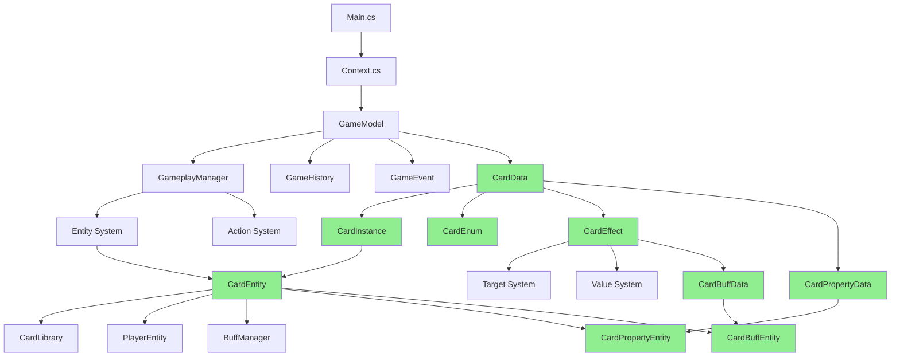

# AI 筆記總索引 - MortalGame 卡牌遊戲專案

## 總覽
本檔案記錄所有AI分析產生的筆記，按照系統分類組織。每個筆記都包含詳細的程式碼分析、功能說明和系統關係。

## 筆記狀態說明
- ✅ 已完成 - 筆記內容完整，無待補完項目
- 🔄 進行中 - 筆記已建立，但仍有內容需要補充
- ⏳ 計劃中 - 尚未開始，但已列入計劃
- 🔗 需要交叉引用 - 筆記中提到其他系統，需要建立連結

---

## 系統筆記列表

### 1. 遊戲模型系統 (GameModel)
| 筆記名稱 | 狀態 | 最後更新 | 備註 |
|---------|------|----------|------|
| GameModel_System.md | ⏳ | - | 核心遊戲狀態管理系統總覽 |
| **GameHistory.md** | ✅ | 2024-12-20 | **遊戲歷史記錄系統（未完成實作）** |
| GameplayManager_Class.md | ⏳ | - | 遊戲流程控制器 |
| **GameContextManager.md** | ✅ | 2024-12-20 | **遊戲上下文管理系統（職責演進中）** |
| GameEvent_Class.md | ⏳ | - | 事件系統 |
| Entity_System.md | ⏳ | - | 遊戲實體系統（卡牌、角色等） |
| Action_System.md | ⏳ | - | 遊戲動作系統 |
| Condition_System.md | ⏳ | - | 條件判斷系統 |
| Target_System.md | ⏳ | - | 目標系統 |
| EnemyLogic_System.md | ⏳ | - | 敵人AI邏輯系統 |

### 2. 遊戲視圖系統 (GameView)
| 筆記名稱 | 狀態 | 最後更新 | 備註 |
|---------|------|----------|------|
| GameView_System.md | ⏳ | - | 視圖展示系統總覽 |

### 3. 用戶介面系統 (UI)
| 筆記名稱 | 狀態 | 最後更新 | 備註 |
|---------|------|----------|------|
| UI_System.md | ⏳ | - | 用戶介面系統總覽 |

### 4. 遊戲資料系統 (GameData)
| 筆記名稱 | 狀態 | 最後更新 | 備註 |
|---------|------|----------|------|
| GameData_System.md | ⏳ | - | 遊戲資料定義系統總覽 |
| **Card_System.md** | ✅ | 2024-12-20 | **卡片系統總覽（三層架構）** |
| **CardData.md** | ✅ | 2024-12-20 | **卡片資料模板類別** |
| **CardEnum_Reference.md** | ✅ | 2024-12-20 | **卡片相關枚舉參考** |
| **CardEffect_System.md** | ✅ | 2024-12-20 | **卡片效果系統（18種效果類型）** |
| **CardInstance.md** | ✅ | 2024-12-20 | **卡片實例Record結構** |
| **CardEntity.md** | ✅ | 2024-12-20 | **卡片戰鬥實體類別** |
| **CardProperty_System.md** | ✅ | 2024-12-20 | **卡片靜態屬性系統（7種屬性類型）** |
| **CardBuff_System.md** | ✅ | 2024-12-20 | **卡片動態Buff系統（生命週期管理）** |
| **Player_System.md** | ✅ | 2024-12-20 | **玩家系統總覽（資料與實體分離）** |
| **PlayerData.md** | ✅ | 2024-12-20 | **玩家資料模板類別（含好感度/AI配置）** |
| **PlayerEntity.md** | ✅ | 2024-12-20 | **玩家戰鬥實體類別（友軍/敵軍差異化）** |
| **Character_System.md** | ✅ | 2024-12-20 | **角色系統總覽（血量單位與勝負核心）** |
| **CharacterEntity.md** | ✅ | 2024-12-20 | **角色實體類別（血量/護甲/Buff管理）** |
| **CharacterBuff_System.md** | ✅ | 2024-12-20 | **角色Buff系統（狀態效果與生命週期）** |
| **EnergyManager.md** | ✅ | 2024-12-20 | **能量管理系統（卡牌費用與資源控制）** |
| **PlayerBuff_System.md** | ✅ | 2024-12-20 | **玩家Buff系統（全域狀態效果與層數管理）** |
| **HealthManager.md** | ✅ | 2024-12-20 | **血量管理系統（角色生存機制核心）** |
| **GameEnum_Reference.md** | ✅ | 2024-12-20 | **遊戲枚舉參考（23種核心枚舉類型）** |

### 5. 場景管理系統 (Scene)
| 筆記名稱 | 狀態 | 最後更新 | 備註 |
|---------|------|----------|------|
| Scene_System.md | ⏳ | - | 場景管理系統總覽 |

### 6. 關卡地圖系統 (LevelMap)
| 筆記名稱 | 狀態 | 最後更新 | 備註 |
|---------|------|----------|------|
| LevelMap_System.md | ⏳ | - | 關卡地圖系統總覽 |

### 7. 核心系統
| 筆記名稱 | 狀態 | 最後更新 | 備註 |
|---------|------|----------|------|
| Main_Class.md | ⏳ | - | 主要入口程式 |
| Context_Class.md | ⏳ | - | 全域上下文系統 |
| BattleBuilder_Class.md | ⏳ | - | 戰鬥建構器 |
| GameplayPresenter_Class.md | ⏳ | - | 遊戲呈現器 |

---

## 交叉引用追蹤

### 待補完的交叉引用
| 來源筆記 | 引用的系統/類別 | 目標筆記 | 狀態 |
|---------|----------------|----------|------|
| Card_System.md | Target系統 | Target_System.md | ⏳ 待建立 |
| Card_System.md | PlayerEntity | PlayerEntity.md | ✅ 已完成 |
| Card_System.md | CardLibrary | CardLibrary.md | ⏳ 待建立 |
| CardEntity.md | PlayerEntity | PlayerEntity.md | ✅ 已完成 |
| CardProperty_System.md | PlayerEntity | PlayerEntity.md | ✅ 已完成 |
| CardBuff_System.md | PlayerEntity | PlayerEntity.md | ✅ 已完成 |
| PlayerEntity.md | CharacterEntity | CharacterEntity.md | ✅ 已完成 |
| PlayerEntity.md | EnergyManager | EnergyManager.md | ✅ 已完成 |
| PlayerEntity.md | PlayerBuffManager | PlayerBuff_System.md | ✅ 已完成 |
| PlayerEntity.md | PlayerCardManager | PlayerCardManager.md | ⏳ 待建立 |
| Character_System.md | HealthManager | HealthManager.md | ✅ 已完成 |
| Character_System.md | CharacterBuffManager | CharacterBuff_System.md | ✅ 已完成 |
| CharacterEntity.md | HealthManager | HealthManager.md | ✅ 已完成 |
| CharacterEntity.md | CharacterBuffManager | CharacterBuff_System.md | ✅ 已完成 |
| CharacterBuff_System.md | CharacterBuffProperty | CharacterBuff_System.md | ✅ 已完成 |
| CharacterBuff_System.md | CharacterBuffLifeTime | CharacterBuff_System.md | ✅ 已完成 |
| CharacterBuff_System.md | ReactionSession | ReactionSession_System.md | ⏳ 待建立 |
| Card_System.md | Faction | GameEnum_Reference.md | ✅ 已完成 |
| CardData.md | Target系統 | Target_System.md | ⏳ 待建立 |
| CardData.md | CardProperty系統 | CardProperty_System.md | ✅ 已完成 |
| CardEffect_System.md | Target系統 | Target_System.md | ⏳ 待建立 |
| CardEffect_System.md | Value系統 | Value_System.md | ⏳ 待建立 |
| CardEffect_System.md | CardBuff系統 | CardBuff_System.md | ✅ 已完成 |
| CardEffect_System.md | EffectExecutor | EffectExecutor.md | ⏳ 待建立 |
| CardInstance.md | CardProperty系統 | CardProperty_System.md | ✅ 已完成 |
| CardEntity.md | CardLibrary | CardLibrary.md | ⏳ 待建立 |
| CardEntity.md | PlayerEntity | PlayerEntity.md | ✅ 已完成 |
| CardEntity.md | Optional Library | Optional_Library.md | ⏳ 待建立 |
| CardEntity.md | BuffManager | CardBuff_System.md | ✅ 已完成 |
| CardProperty_System.md | TriggerContext | TriggerContext.md | ⏳ 待建立 |
| CardBuff_System.md | TriggerContext | TriggerContext.md | ⏳ 待建立 |
| CardBuff_System.md | CardBuffLibrary | CardBuffLibrary.md | ⏳ 待建立 |
| CardBuff_System.md | BuffManager | CardBuff_System.md | ✅ 已完成 |

### 系統依賴關係

---

## 統計資訊
- **總筆記數量**: 21
- **已完成筆記**: 21
- **進行中筆記**: 0
- **計劃中筆記**: 9
- **待補完交叉引用**: 7 (已完成11個)

## 卡片系統分析完成統計
- **✅ Card_System.md**: 卡片系統三層架構總覽
- **✅ CardData_Class.md**: ScriptableAsset卡片模板
- **✅ CardEnum_Reference.md**: 7種枚舉定義（武俠主題）
- **✅ CardEffect_System.md**: 18種效果類型（角色/玩家/卡片目標）
- **✅ CardInstance_Class.md**: Runtime卡片實例（Record結構）
- **✅ CardEntity_Class.md**: 戰鬥實體（完整功能）
- **✅ CardProperty_System.md**: 靜態屬性系統（7種屬性類型）
- **✅ CardBuff_System.md**: 動態Buff系統（生命週期管理）

## 系統設計亮點
- **🏗️ 清晰分層**: Data→Instance→Entity三層架構
- **⚡ 動態效果**: Property（靜態）vs Buff（動態）完美結合
- **🎯 武俠主題**: 從門派設定到卡片類型都體現武俠元素
- **🔧 現代特性**: Record、Optional、UniRx等現代C#特性應用
- **📊 編輯器友好**: Odin Inspector提供優秀的設計師工作流程

---

## 更新日誌
| 日期 | 操作 | 說明 |
|------|------|------|
| 2024-12-20 | 創建 | 建立AI筆記總索引系統 |
| 2024-12-20 | 完成 | **卡片系統完整分析** - 6篇筆記 |
| 2024-12-20 | 更新 | 新增14個交叉引用追蹤項目 |
| 2024-12-20 | 更新 | 系統依賴關係圖包含卡片系統 |
| 2024-12-20 | 完成 | **屬性&Buff系統** - CardProperty & CardBuff |
| 2024-12-20 | 更新 | 完善交叉引用，新增4個追蹤項目 |
| 2024-12-20 | 完成 | **三大BuffManager系統整理** - CardBuffManager, CharacterBuffManager, PlayerBuffManager |
| 2024-12-20 | 增強 | 為三個Buff系統筆記添加完整的Manager管理器說明，包含對比分析和使用範例 |
| 2024-12-20 | 重構 | **統一筆記命名規範** - 移除冗余_Class後綴，更新所有文件名和交叉引用 |
| 2024-12-20 | 修正 | 修正BuffManager交叉引用狀態，CharacterBuffManager和CardBuffManager已整合在對應的_System筆記中 |
| 2024-12-20 | 新增 | **HealthManager.md** - 角色血量和護盾管理系統，包含傷害類型、治療機制、數值安全 |
| 2024-12-20 | 完善 | **CharacterBuff_System.md** - 補充CharacterBuffProperty和CharacterBuffLifeTime詳細分析，包含屬性系統和生命週期管理 |
| 2024-12-20 | 新增 | **GameEnum_Reference.md** - 完整遊戲枚舉參考文檔，涵蓋23種核心枚舉類型，包含武俠主題設計和系統整合分析 |
| 2024-12-20 | 新增 | **GameHistory.md** - 遊戲歷史記錄系統分析，目前為未完成實作狀態，包含完整的實作建議和系統集成方案 |
| 2024-12-20 | 新增 | **GameContextManager.md** - 遊戲上下文管理系統，統一管理資料庫和玩家選擇狀態，職責定義持續演進中 |

---

**使用說明**：
1. 每次新增筆記後，必須在此檔案中更新對應條目
2. 變更筆記狀態時，更新狀態欄位和最後更新時間
3. 發現新的交叉引用時，在「交叉引用追蹤」區域記錄
4. 定期更新統計資訊和系統依賴關係圖

最後更新：2024-12-20